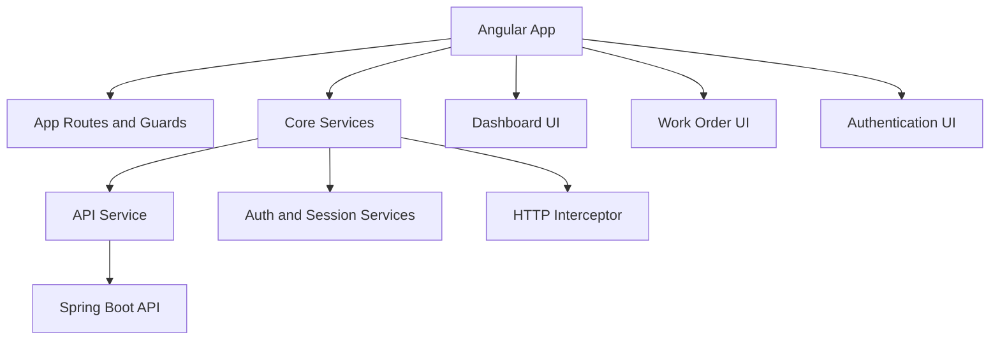
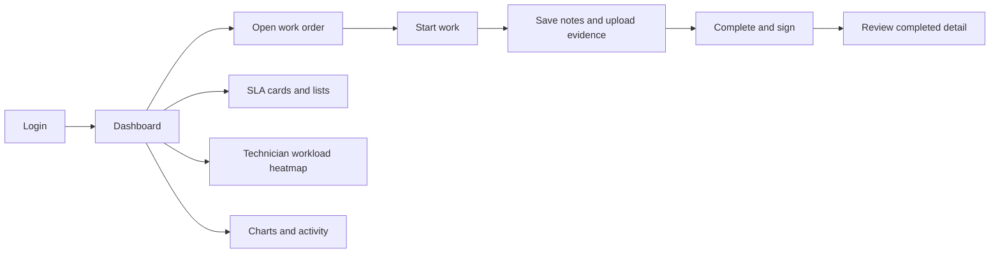
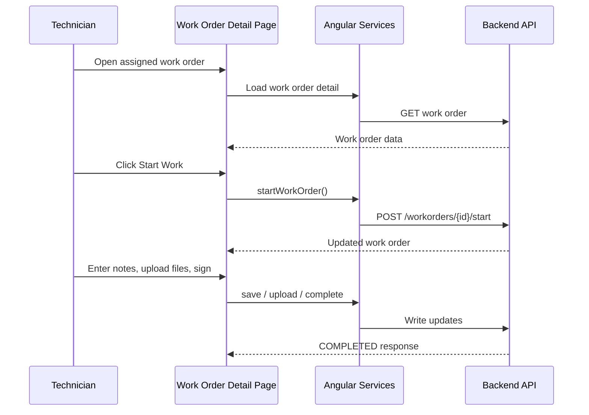
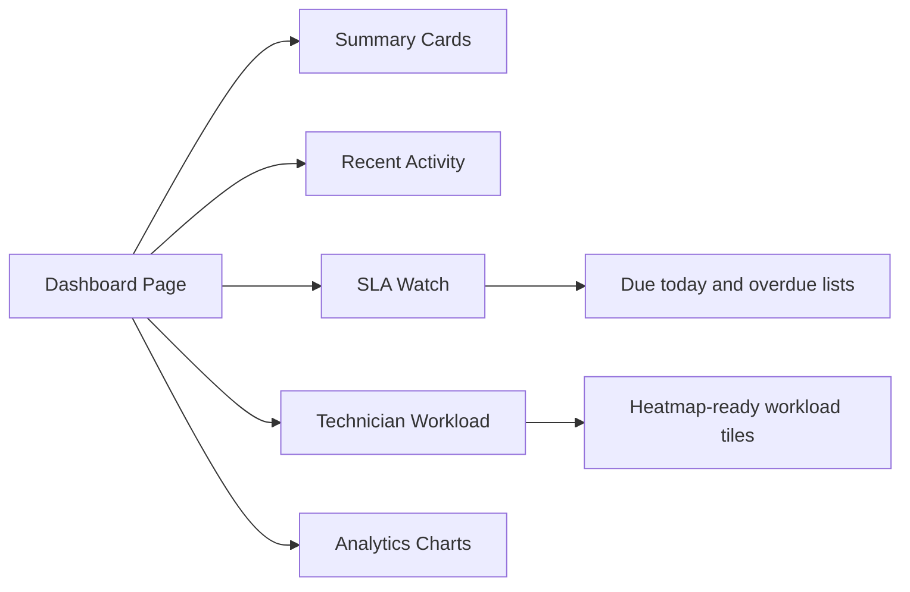
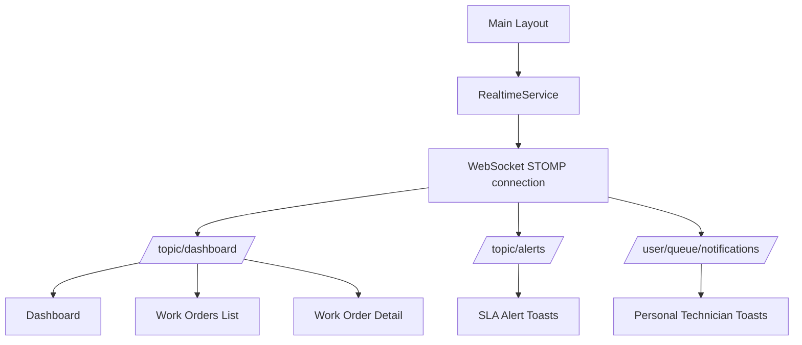
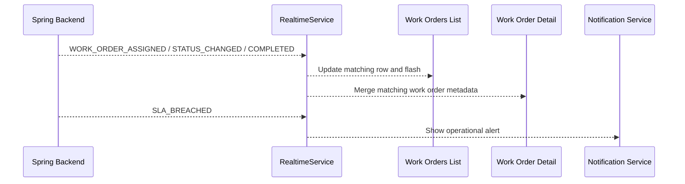
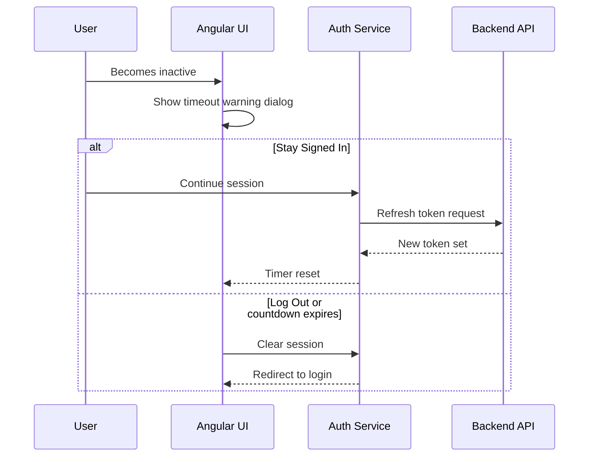
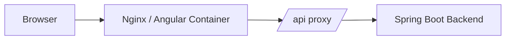

# A3 Field Service Management Frontend

## Plain-English Overview

The frontend is the working face of A3 FSM.

It turns backend rules into a clear daily workflow for:

- admins creating and managing work orders
- dispatchers assigning and monitoring jobs
- technicians starting work, documenting the visit, and completing jobs in the field

The goal is not just to display data. The goal is to make the right action obvious at the right moment.

## How To Read This With The Root Diagrams

In the combined workspace, the root README gives the best visual overview of the whole platform. Start there if you want the clearest picture of:

- the current-state architecture
- the future-state architecture direction
- the realtime assignment, completion, and SLA flow

This frontend README then narrows the view to the user-facing experience built on top of those flows.

## Frontend Highlights For Reviewers

This frontend is a strong showcase piece because it goes beyond page rendering:

- the UI changes meaningfully by role instead of simply hiding a few buttons
- workflow guards mirror backend rules so the experience feels intentional
- dashboards mix operational insight with analytical views
- the UX is shaped around real technician and dispatcher actions, not abstract sample data
- the Sprint 12 visual system turns those workflows into a responsive enterprise SaaS experience
- reports can be filtered and exported as CSV or branded PDF files

## Sprint 12 Product Polish

Sprint 12 keeps the existing Angular business logic and modernizes the presentation layer around it.

- shared color, spacing, radius, surface, and elevation tokens
- responsive sidenav that becomes a mobile drawer below 900px
- polished toolbar and role-aware navigation
- role-framed dashboard headers and report access
- responsive work-order and technician tables
- lazy-loaded Reports workspace for Admin and Dispatcher
- Chart.js status/priority reporting
- jsPDF and AutoTable PDF generation
- standards-compliant CSV generation

The Reports route consumes `GET /api/reports/operations?from=YYYY-MM-DD&to=YYYY-MM-DD` and uses the same response for the on-screen dashboard, CSV file, and PDF document. This keeps exported metrics consistent with what the user reviewed on screen.

## What The Frontend Is Responsible For

- authentication screens and protected navigation
- role-aware dashboard views
- work order list and detail screens
- technician execution workflow
- structured completion reporting and signature capture
- attachment upload, preview, and download flows
- session timeout warnings and sign-out behavior
- chart-based operational analytics

## UI-Level Architecture Diagram



This diagram shows the frontend slice of the larger system view introduced in the root README.

## User Roles And Experience

### Admin

Sees the broader operational picture:

- global dashboard KPIs
- analytics charts
- SLA watch
- technician workload visibility
- recent activity
- reopen and management controls where permitted

### Dispatch

Works close to operations:

- monitors assignment pressure
- reviews workload visibility
- tracks due-today and overdue jobs
- supports rescheduling and reassignment

### Technician

Gets a tighter workflow centered on execution:

- assigned work order detail
- start work action
- field notes and attachments
- structured completion report
- sign-off flow
- personal SLA-focused dashboard behavior

## Demo-Friendly UX Story

If you are presenting the frontend, a strong walkthrough is:

1. Log in as admin or dispatch to show the operational dashboard and visual summaries.
2. Open a work order and explain how the status lifecycle drives the available actions.
3. Switch to technician flow to show start work, notes, attachments, completion, and sign-off.
4. Return to the dashboard to connect field execution back to SLA, workload, and analytics visibility.

## Use Case Diagram



## Workflow Diagram



## Dashboard Design

The dashboard is split into layers so it can support both everyday operations and more strategic reporting.

### Operational Layer

- KPI cards
- recent activity
- SLA watch
- technician workload overview

### Analytical Layer

- status distribution chart
- priority distribution chart
- completion trend chart

### Role-Aware Layer

- admin and dispatch get the broader operational picture
- technicians get a more personal, action-oriented view



## How The Root Visuals Map To Frontend Experience

The visual diagrams in the root README connect to this frontend in three practical ways:

- current-state architecture: this Angular app is the shared entry point for admin, dispatch, and technician users
- future-state architecture: even if backend services split later, the frontend can still present one consistent workflow and dashboard experience
- realtime business flow: assignment updates, completions, and SLA changes are surfaced here as refreshed dashboards, status updates, and technician-facing actions

## Sprint 8 Realtime Experience

Sprint 8 adds a shared realtime layer to the Angular application.

The app connects once from the authenticated main layout, then feature screens subscribe to the event streams they need:

- dashboard events from `/topic/dashboard`
- SLA alerts from `/topic/alerts`
- personal technician notifications from `/user/queue/notifications`



### Dashboard Realtime Behavior

Dashboard subscriptions update:

- KPI and SLA card pressure
- recent activity
- analytics and workload snapshots
- SLA breach alert routing

### Work Orders List Realtime Behavior

The list responds to:

- new work order creation
- technician assignment
- status changes
- completion events
- return-to-open and reopen events

Rows update in place and flash briefly so dispatchers can spot live changes.

### Work Order Detail Realtime Behavior

The detail page updates visible fields without a manual refresh:

- status
- assigned technician
- priority and scheduled date metadata
- completion timestamp
- SLA breach alerts



## Workflow Guards In The UI

The frontend mirrors backend rules so users are guided away from invalid actions before they even click.

Examples:

- start button only appears when starting is allowed
- complete action is only enabled while a work order is `IN_PROGRESS`
- save notes and upload actions are disabled in read-only states
- reopen is only shown for authorized operational roles
- duplicate clicks are blocked while actions are in flight

This keeps the application feeling polished while still relying on the backend as final authority.

## Session And Timeout Experience

The frontend includes a session timeout flow designed for real usage:

- after inactivity, a warning dialog appears
- the user sees a countdown
- `Stay Signed In` resets the session flow
- `Log Out` signs the user out immediately
- if ignored, the session expires and the user is redirected to login



## Charts And Visual Reporting

Sprint 6 introduced dashboard charts to make trends easier to understand at a glance.

Current visualizations include:

- work orders by status
- work orders by priority
- completion trend over time

The chart layer is designed to stay clean:

- backend returns dashboard-specific DTOs
- frontend maps them into chart-friendly data once
- the template remains simple and readable

## Heatmap Foundation

The technician workload section is built so it can start as cards and mature into a compact dispatch heatmap.

Workload intensity can reflect:

- overdue assigned work
- due-today pressure
- total active assigned work

That makes the dashboard more than informative. It starts becoming operationally predictive.

## Local Development

### Start The Angular App

```bash
npm install
npm start
```

Typical local frontend URL:

- `http://localhost:4200`

## Docker Notes

The Docker setup is designed so the frontend can build and run cleanly in containers.

Important details:

- API requests are routed through a frontend proxy or Nginx layer
- local font assets are bundled so production builds do not depend on Google Fonts at build time
- this avoids certificate and network issues during container builds



## UX Principles

This frontend is aiming for a practical field-service feel:

- show the next valid action clearly
- reduce opportunities for invalid clicks
- keep important states visible
- make dashboards meaningful for different roles
- keep the interface simple enough for non-technical operational users

## Where The Frontend Is Headed

The current design leaves room for:

- durable notification history
- technician-specific recent activity feeds
- dashboard click-through filters
- more advanced workload balancing views
- richer notification patterns for operational teams

## Related Documentation

- [Root README](../../README.MD)
- [Backend README](../../A3%20Field%20Service%20Management%20Backend/README.MD)

## Closing Summary

The frontend is where process becomes experience.

Its job is to make complex operational rules feel simple:

- log in
- see what matters
- take the next correct action
- capture the right evidence
- close the loop cleanly

That is what turns a technically sound backend into a platform people can actually use with confidence.
